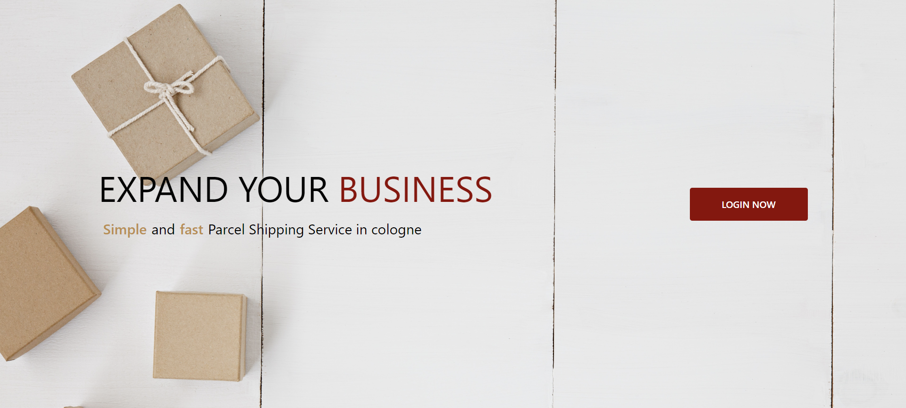
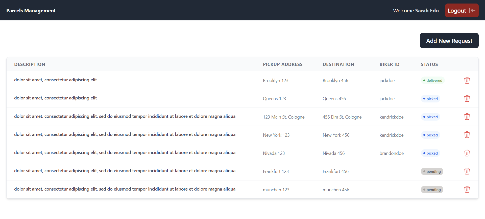
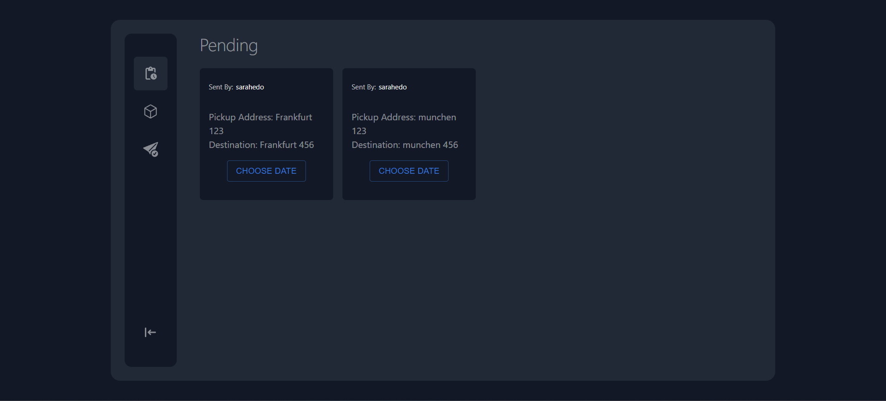

# Parcels Management App

## Installation

  - Make Sure you have Node.js installed
  - cd into server directory and Run `npm install` to install Back-End dependencies
  - cd into frontend directory and Run `npm install` to install Front-End dependencies

## Getting Started

  - cd into server directory and locate **.env.example** file and then Remove **.example** extention from it, The final result should be `.env`

    > Open two terminal windows and do the following:
      - cd into root directory and Run `npm run backend` to run backend in development
      - cd into root directory and Run `npm run frontend` to run frontend in development

## Project Breakdown
  ### Login Page

  - Quick Start As A Sender: **username:** "sarahedo", **password:** "password"
  - Quick Start As A Biker: **username:** "jackdoe", **password:** "password"
  

  **The project contains 2 Dashboards for two types of users (Bikers and Senders).**

  ### Sender Dashboard

    - A Sender can see all his requests and request status for each one through his dashboard
    - A sender can create a parcel by clicking on "Add New Request" Button.
    - The status of the order is updated for the sender whenever it's picked or delivered by a biker
  

  ### Biker

    - A biker can see and pick Pending Parcels
    - Once a parcel is picked up by a biker, it cannot be picked up by other bikers.
    - A biker should input the timestamp of the pickup and the delivery for each order.
    - A biker should change the status of the parcel to "delivered" once the package is delivered
  

## Used Tecknologies:
  - Frontend: React.js, Typescript, Next.js, Material UI, Tailwind CSS, axios
  - Backend: Node.js, Express.js, Typescript, JWT Authentication using jsonwebtoken, Authorization using bcrypt
  - Docker

## Upcoming Features
  - Adding PostgreSQL Database